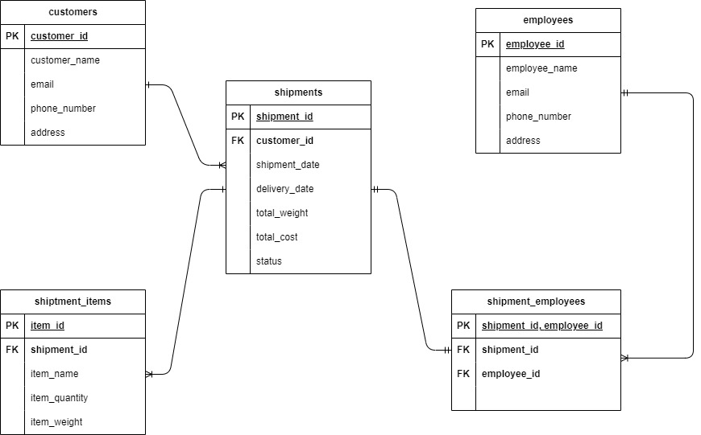

# Shipment Management Database

The courier shipment management database is designed to efficiently manage and track various aspects of the shipment process. It consists of several tables interconnected through relationships. 

The database allows for efficient management of courier shipments by maintaining customer information, tracking shipment details, managing individual shipment items, and assigning employees to handle shipments. The relationships between tables enable data retrieval and reporting, providing a comprehensive view of the courier shipment process. Here's an overview of the database :

- customers : This table stores information about customers, including their names, contact details (email and phone number), and addresses. Each customer can be associated with multiple shipments.

- shipments : This table contains details about individual shipments. It includes information such as shipment ID, customer ID (referencing the Customers table), shipment date, delivery date, total weight, total cost, and status. Multiple items can be associated with a single shipment.

- items : This table holds information about individual items within a shipment. It includes attributes like item ID, shipment ID (referencing the Shipments table), item name, quantity, and weight. Each shipment can have multiple items associated with it.

- delivery_employees : This table stores data related to employees responsible for handling shipments. It includes details such as employee ID, employee name, email, phone number, and address. Multiple employees can be assigned to handle different shipments.

- shipment_employee_mapping : This table represents the relationship between shipments and employees. It serves as a junction table to track which employees are assigned to handle specific shipments. It includes the shipment ID and employee ID as foreign keys, referencing the respective tables.

---

## ER Diagram



---

## DB Scripts

DB scripts can be found in directory "db/migration" and they are versioned and compatible with Flyway migration. Order of versioning

- roles : V100.*__
- grants : V200.*__
- users: v300.*__
- tables : v400.*__
- views : V500.*__
- insert : V600.*__

---

## Docker

Docker Compose is used to deploy the MYSQL DB and Flyway services. Deploy the docker compose stack using the following commands from the project directory.

```
docker compose -f docker/docker-compose.yaml build

docker compose -f docker/docker-compose.yaml up -d
```
Once the services are up, copy contents of "db" folder inside flyway container at path "/flyway/"
```
docker container cp db docker-flyway-1:/flyway
```
Login to the flyway container
```
docker container exec -it docker-flyway-1 bash
```
Inside the flyway container's shell run flyway commands to execute the DB scripts
```
flyway info

flyway migrate

flyway validate
```